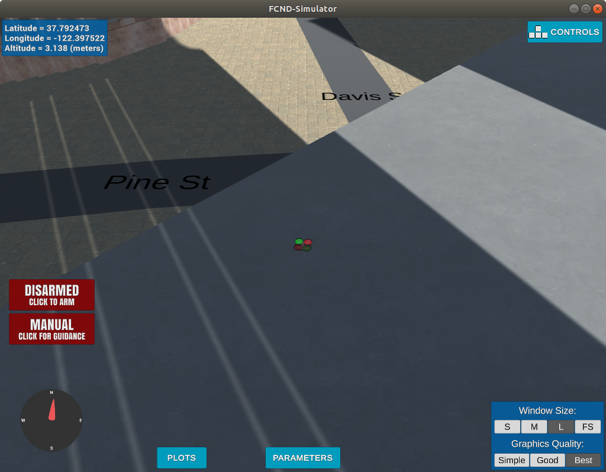
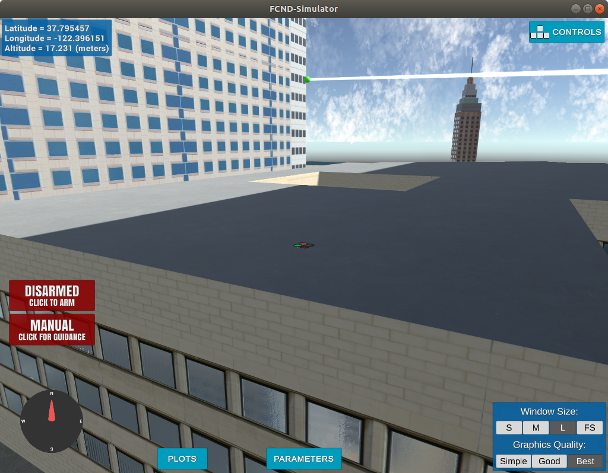

## Implementing Your Path Planning Algorithm

### 1. Set your global home position

The global home position is set to the centre of the map
The altitude is set to 3.1 to compensate for the buggy building that pops up on the road
(Bug was observed on Ubuntu 18.04 as well as Windows 10)

```
        self.set_home_position(lon0, lat0, 3.1)
```
The landing transition trigger also had to be edited to compensate for the bug
The threshholds have been updated to 3.1, anything less than that does not seem to work
```
    def velocity_callback(self):
        if self.flight_state == States.LANDING:
            if self.global_position[2] - self.global_home[2] < 3.1:
                if abs(self.local_position[2]) < 3.1:
                    self.disarming_transition()
```

### 2. Set your current local position

To find the current local position , we first find the current global position
Convert the current global position to local position using the `global_to_local()` function 

```
cur_global_position =  self.global_position # lon, lat, alt in degrees and meters
cur_local_position = global_to_local(cur_global_position, self.global_home) # NED relative to home position
```

### 3. Set grid start position from local position

Using the local position and north and east offests we set the start position as the current local position

```
        north, east = int(cur_local_position[0]), int(cur_local_position[1])
        grid_start = (north + (-north_offset), east + (-east_offset))
```

### 4. Set grid goal position from geodetic coords

The goal coordinates in lat,lon, alt format is converted to north,east,down using the `global_to_local()' function
Then the offsets are added to the local coordinates to get the position on the grid.

```
        goal_in_global = [-122.397337, 37.792572, TARGET_ALTITUDE]
        north_delta, east_delta, _ = global_to_local(goal_in_global, self.global_home)
        grid_goal = (-north_offset + int(north_delta), -east_offset + int(east_delta))
```

### 5. Modify A* to include diagonal motion (or replace A* altogether)

For the path planning problem, I have chosen to use a graph based representation of the space.
Specifically , I use PRM to represent the space. The choice is because this is a predefined map which is relatively small in size and a PRM with 1000 to 3000 nodes is probablisticaly guaranteed to cover most of the map

Here I have reused the available code from the excercise to generate the graph.
The points are sampled within the map bounds for north, east and a user definied height for altitude

In the solution I use , a total of 3000 samples are taken with a connection factor <= 10.

For the purpose of faster computation , I have implemnted the path planning funciton in a seperate module (make_path.py). Having the path planning functions in the same process as the simulator makes the computations slow, which in turns blocks the process and causes the simulator to timeout and crash.

```
def create_graph(nodes, k, polygons):
    print("Creating graph..")
    def can_connect(n1, n2):
        l = LineString([n1, n2])
        for p in polygons:
            if p.crosses(l) and p.height >= min(n1[2], n2[2]):
                return False
        return True

    g = nx.Graph()
    tree = KDTree(nodes)

    for n1 in tqdm(nodes):
        # for each node connect try to connect to k nearest nodes
        idxs = tree.query([n1], k, return_distance=False)[0]
        
        for idx in idxs:
            n2 = nodes[idx]
            if n2 == n1:
                continue
                
            if can_connect(n1, n2):
                g.add_edge(n1, n2, weight=1)
    return g
```

### 6. Cull waypoints 

Here I have chosen not to prune the way points since the representation is PRM.
Due to the randomness of the waypoints the chances of there being collinear points is very low.
Although the determinant based colliearity check could be applied for 3D points, as mentioned in the lecture notes, the determinant is not a sufficent condition for collinearity

For 2D points , the following code could be applied

```
def point(p):
    return np.array([p[0], p[1], 1.]).reshape(1, -1)

def collinearity_check(p1, p2, p3, epsilon=1e-6):   
    m = np.concatenate((p1, p2, p3), 0)
    det = np.linalg.det(m)
    return abs(det) < epsilon

def prune_path(path):
    if path is not None:
        pruned_path = [p for p in path]
        # TODO: prune the path!
        i = 0
        while i < len(pruned_path) - 2:
            p1 = point(pruned_path[i])
            p2 = point(pruned_path[i+1])
            p3 = point(pruned_path[i+2])
            
            if collinearity_check(p1, p2 ,p3):
                pruned_path.remove(pruned_path[i+1])
            else:
                i += 1
    else:
        pruned_path = path
        
    return pruned_path

```

## Other implementation notes

In the final implementaion I have made small changes to the original motion_planning.py to support the PRM based 3D path planning.

Here are the images of start and goal positions.


### 1. Start Positon


### 1. Goal Positon


### Here is a <a href="https://youtu.be/TR6J0TWS7p0">video</a> of the drone in action

